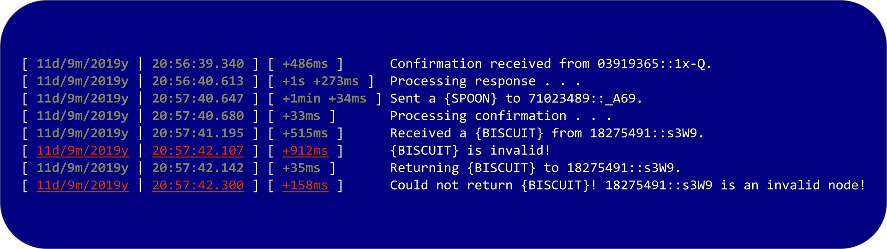
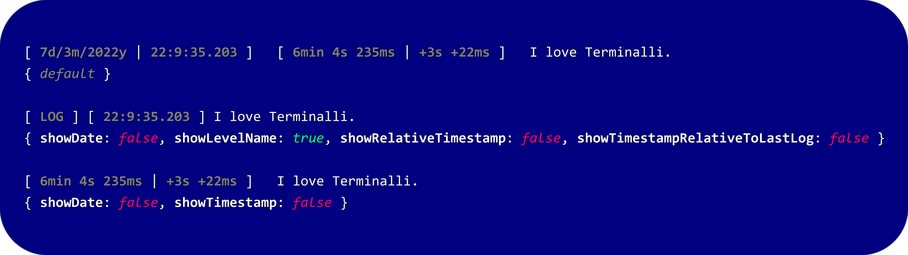

# TERMINALLI

This NPM package adds helpful timestamps to your logs to help you know when things happen. It is customizable as well!

## FEATURES

This is not a feature-rich package. None the less, features include:

-   Ability to have each log show the exact date and time when it was sent to the console.
-   Ability to have _relative_ timestamps. These include timestamps relative to when the previous message was logged to the console.
-   Being able to add or remove any of these types of timestamps from your logs.
-   Having the ability to log errors. These error logs are highlighted in red.

## CUSTOMIZABILITY

Terminalli offers the ability to add or remove any of these features to your liking. The following picture illustrates how you change the way your logs look.

## CONTRIBUTING

This NPM package is currently not very feature-rich. Please contribute to make Terminalli better.

-   For bugs/feature suggestions, click [here](https://github.com/Benjalaazshah/Terminalli/issues).

-   For the GitHub repository, click [here](https://github.com/Benjalaazshah/Terminalli).
