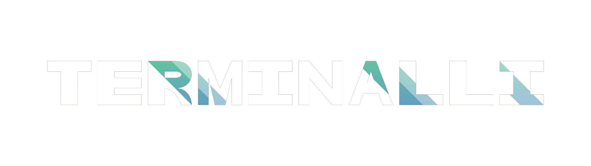
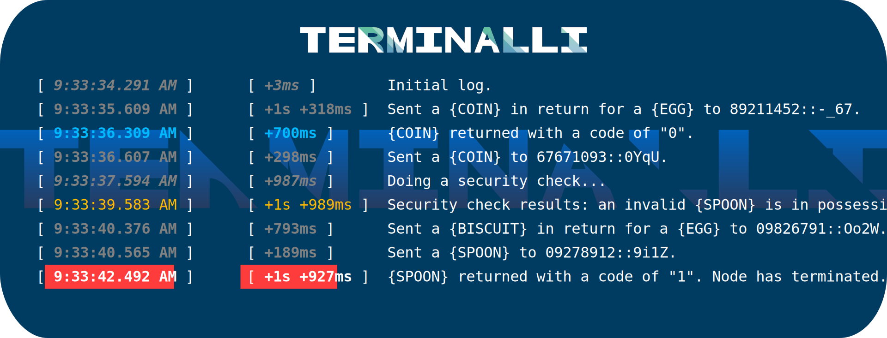
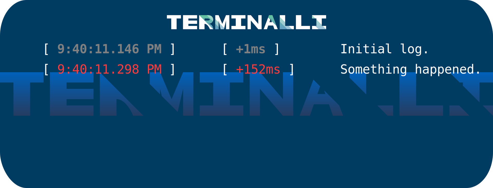
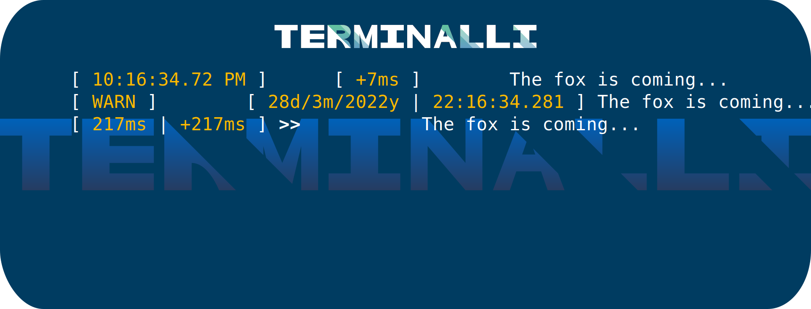
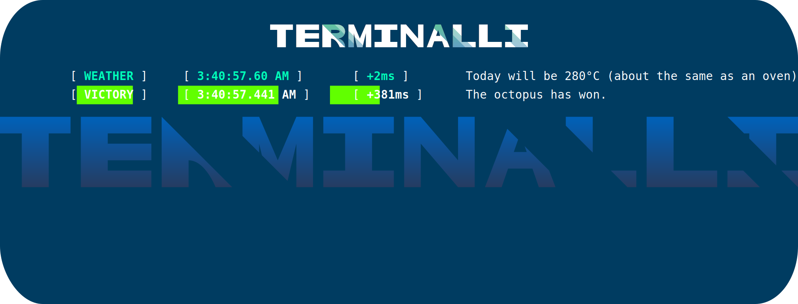

<div align="center">

# 

[![[ INSTALL ]](https://img.shields.io/badge/INSTALL-npm%20i%20termialli-ff0000.svg?style=flat-square&logo=npm)](https://www.npmjs.com/package/terminalli "View NPM package")
[](./LICENSE "View license")
[](./CHANGELOG.md "View changelog")

Still using `console.log` in 2022?! With Terminalli, you can attach timestamps to your logs, organize your logs into different categories (levels) with their own unique color and more!

</div>



## FEATURES

### **Features include:**

-   Ability to have each log show the exact date and time when it was sent to the console.
-   Ability to have _relative_ timestamps in your logs. These include timestamps relative to when the previous message was logged to the console.
-   Being able to add or remove any of these types of timestamps from your logs.
-   ![[ NEW ]](https://img.shields.io/badge/-NEW-008000.svg?style=square "New") You are now able to log to up to 6 different preset levels/categories, all of which have there own color.
-   ![[ NEW ]](https://img.shields.io/badge/-NEW-008000.svg?style=square "New") As well as that, you can create custom levels with whatever color you desire!

## BASIC USAGE

First, import the `Terminal` class from Terminalli.

```js
import Terminal from "terminalli";
```

Next up is to create your terminal.

```js
const terminal = new Terminal({
	levels: [
		// Levels...
	]
});
```

Right inside of `levels` is where you are free to define your different levels/categories that you can log to. But to save time, you can import a bunch of preset levels like this:

```js
import Terminal, { advancedLevels } from "terminalli";

const terminal = new Terminal({ levels: advancedLevels });
```

> ![[ NOTE ]](https://img.shields.io/badge/-NOTE-000080.svg?style=square "Note") If you want to learn how to create custom levels, continue reading [here](./README.md#custom-levels 'View "CUSTOM LEVELS" section').

To start logging things, do so like this:

```js
terminal.log.debug("Initial log.");
```

`debug` in this case is the name of one of the preset levels that you can log to. If you were logging an error, for example, you can use the `error` level.

```js
terminal.log.error("Something happened.");
```

### **Output:**



## CUSTOMIZABILITY

Upon creating a new instance of the `Terminal` class, you can turn on and off a bunch of options that determine how logs are to be displayed in the terminal. In the following example, there are three instances of the `Terminal` class all with different settings.

### **Code:**

```js
import Terminal, { advancedLevels } from "terminalli";

const t1 = new Terminal({
	levels: advancedLevels
});

const t2 = new Terminal({
	levels: advancedLevels,
	showDate: true,
	showLevelName: true,
	showTimestampRelativeToLastLog: false,
	use24HourClock: true
});

const t3 = new Terminal({
	levels: advancedLevels,
	showArrow: true,
	showRelativeTimestamp: true,
	showTimestamp: false
});

t1.log.warn("The fox is coming...");
t2.log.warn("The fox is coming...");
t3.log.warn("The fox is coming...");
```

### **Output:**



## CUSTOM LEVELS

Creating custom levels is as simple as it gets! In the following example, there are two additional custom levels, alongside the preset levels, called `weather` and `victory`.

### **Code:**

```js
import Terminal, { advancedLevels } from "terminalli";

const terminal = new Terminal({
	showLevelName: true,

	levels: [
		...advancedLevels,
		{
			color: ["bgGreen", "white", "bold"],
			isError: false,
			name: "victory"
		},
		{
			color: ["cyan", "bold", "underline"],
			isError: false,
			name: "weather"
		}
	]
});

terminal.log.weather("Today will be 280°C (about the same as an oven).");
terminal.log.victory("The octopus has won.");
```

### **Output:**



---

<div align="center">

## LICENSE

<h6>
<sup>
<sup>
<sup>

MIT License

Copyright (c) 2022 Benjalaazshah

Permission is hereby granted, free of charge, to any person obtaining a copy
of this software and associated documentation files (the "Software"), to deal
in the Software without restriction, including without limitation the rights
to use, copy, modify, merge, publish, distribute, sublicense, and/or sell
copies of the Software, and to permit persons to whom the Software is
furnished to do so, subject to the following conditions:

The above copyright notice and this permission notice shall be included in all
copies or substantial portions of the Software.

THE SOFTWARE IS PROVIDED "AS IS", WITHOUT WARRANTY OF ANY KIND, EXPRESS OR
IMPLIED, INCLUDING BUT NOT LIMITED TO THE WARRANTIES OF MERCHANTABILITY,
FITNESS FOR A PARTICULAR PURPOSE AND NONINFRINGEMENT. IN NO EVENT SHALL THE
AUTHORS OR COPYRIGHT HOLDERS BE LIABLE FOR ANY CLAIM, DAMAGES OR OTHER
LIABILITY, WHETHER IN AN ACTION OF CONTRACT, TORT OR OTHERWISE, ARISING FROM,
OUT OF OR IN CONNECTION WITH THE SOFTWARE OR THE USE OR OTHER DEALINGS IN THE
SOFTWARE.

</sup>
</sup>
</sup>
</h6>
</div>
